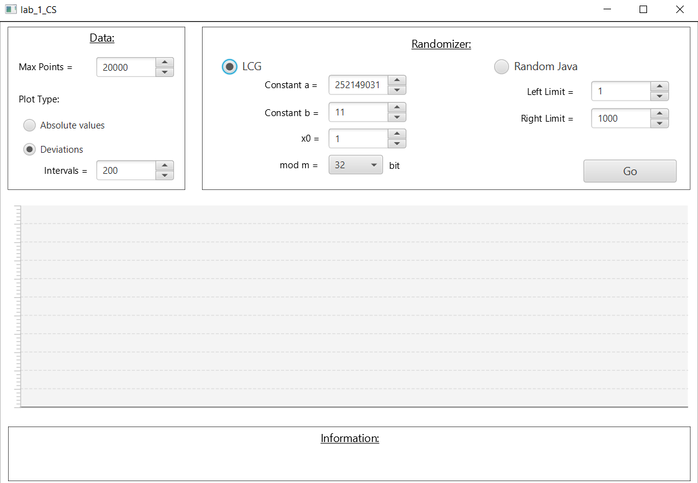
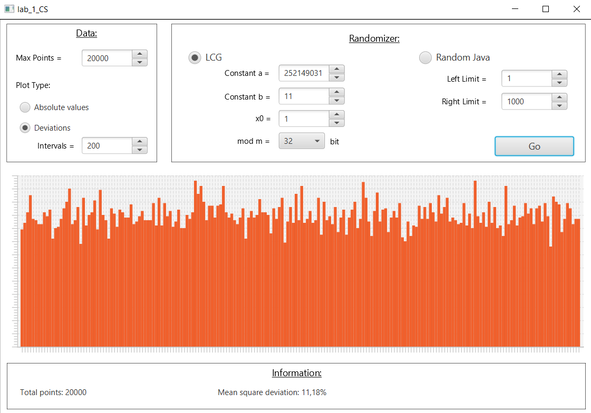
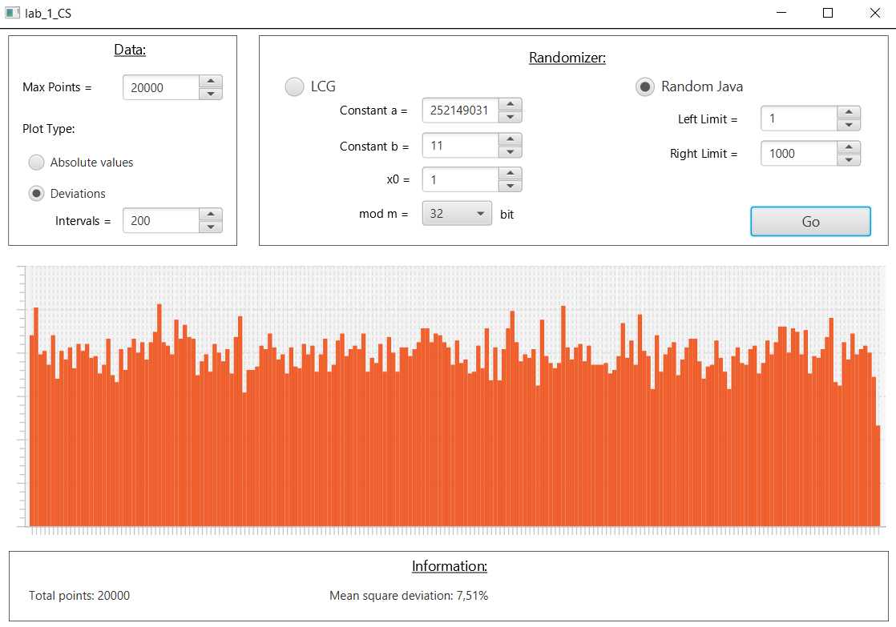
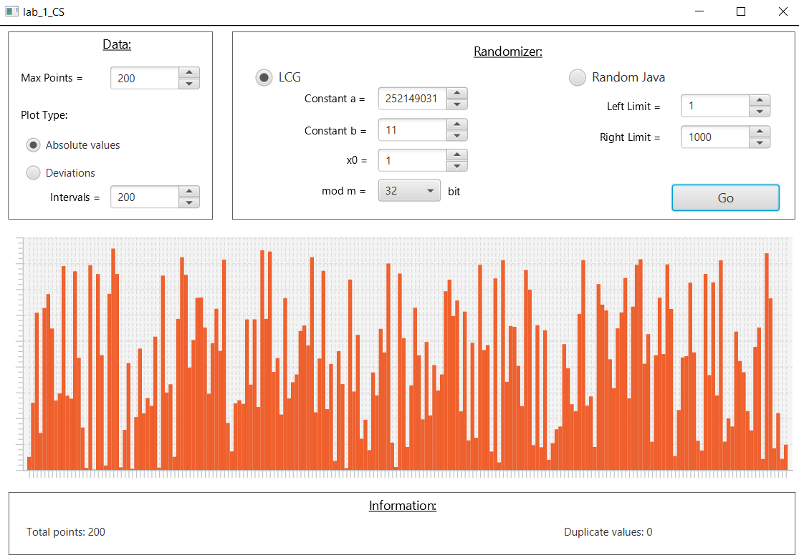
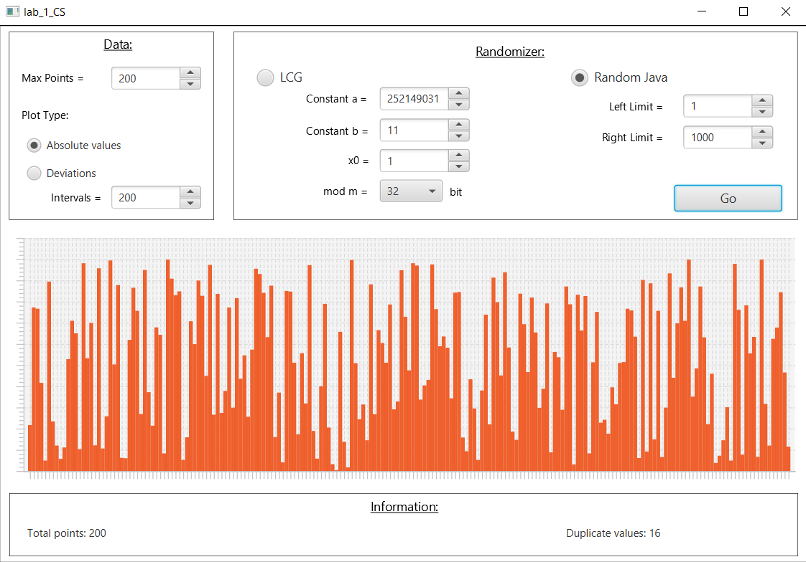

# Java_JavaFX

####  Линейный конгруэнтный генератор случайных чисел по заданной математической формуле и функция rendom() в языке Java с последующей отрисовкой на графике среднеквадратического отклонения полученных значений.

